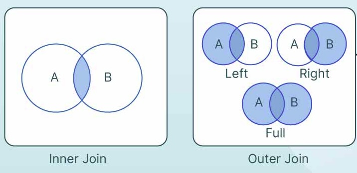

```{r setup, include=FALSE}
knitr::opts_chunk$set(echo = TRUE)
```

# Introduction to Data Analysis using Tidyverse, dplyr and stringr

This is part two of simple data analysis using tidyverse and dplyr and stringr. It consists of more advanced topics

```{r}
library(tidyverse)
library(dplyr)
library(stringr)


df<-read_csv("./data/twitter_data_chatgpt.csv.bz2", skip_empty_rows = TRUE)
```

#### Preprocessing.. again.
Because we reloaded the data, we need to do the same preprocessing again.We again check drop any NA values and remove any duplicates

```{r}

df<-na.omit(df)
df<-df%>%distinct(id, .keep_all = TRUE)

df<-df%>%rename(created_at=date,
                text=content)

df$engagement_count<-df$like_count+ df$retweet_count
df$like_retweet_difference<-df$like_count-df$retweet_count
df$like_retweet_ratio<-df$like_count/df$retweet_count
```


# Filtering Data
Filtering is the process of subsetting a dataset based on a logical condition.
It allows you to zoom in on relevant data: analyze them, visualize them, discard them or do certain manipulations on them much. You will be using it a lot. 

Let's filter the tweets that acquired at least 1 engagement (remember our newly created column engagement counts which is likes plus retweets?)
For that we need to create a mask that has True for all the rows where the engagement_count is greater than 0. (or more than or equal to 1)
This is simple:


```{r}
df%>%filter(engagement_count>0) #can also write as >=1
```

You can filter by multiple conditions. 
You have to wrap each condition in parentheses and put logical operators like & (AND), | (OR).

For instance, suppose we want tweets that have some engagements but they should have AT LEAST ONE retweet so:


```{r}

df%>%filter(engagement_count>=1&retweet_count>=1)
```
Note that you can always define variables which to save the filtered data for use later:

Suppose I want to later conduct an analysis only on people with engagement greater than 0 and more than 0 retweets into a df called at_least_one_rt_and_engagement:
```{r}
at_least_one_rt_and_engagement<-df%>%filter(engagement_count>=1&retweet_count>=1)
```


You can use grepl() from the dplyr package togethwe with filter to filter based on particular strings of characters present in your dataframe. Grepl() used regex patterns to filter strings. You can go [HERE](https://regexr.com/) to view the cheatsheet for different regex notation. 

For now, let's filter the tweets that start with '@', these are replies.

Hint you can use startsWith() for this simple filtering from base R (do not use starts_with from dplyr thats is for finding column names starting with a specified string):

```{r}
df%>% filter(grepl("^@", text))

df%>%filter(startsWith(text, "@"))

```

You can also use str_detect() from stringr package to detect the presence of a string in any part of the text. 
Tweets that contain a link:

```{r}

df%>%filter(str_detect(text, 'https://')|str_detect(text,'http://'))
```

Let's find the tweets authored by me (TJ)! Omg I'm busted :o 

```{r}

df%>% filter(username=="tugrulcanelmas")
```
What if we want to collect tweets from multiple users and thus, have to do multiple comparisons? We can go like `(username == 'tugrulcanelmas') | (username == 'elonmusk') | (....)` but that is just too much code. 

It's better to create a list of usernames and then use `%in%` operator.
Let's get tweets from SICSS Organizers: @tugrulcanelmas, @Walid_Magdy, 'Bjoernross, @TVGsociologist, @ZeerakTalat


```{r}
SICSS_list<-c('tugrulcanelmas', 'Walid_Magdy', 'Bjoernross', 'TVGsociologist', 'ZeerakTalat')

df%>%filter(username %in% SICSS_list)
```


### Filter & Mutate
You can create new columns by filtering on existing data.
For that, you need to use mutate() to access columns and then assign new values together with case_when().
The first time you do this on undefined, R will create a new column.

Let's say we want to create a new column named "tweet_type" that indicates whether if the tweet is a __retweet__, a __reply__ or a regular, plain __tweet__.


```{r}
#remember to assign what you do back to df so you can save the changes !!!
df<-df%>%mutate(
  tweet_type=case_when(startsWith(text, "RT")  ~ "retweet",
                       startsWith(text, "@") ~ "reply",
                       TRUE ~ "tweet")) #if you don't tell R what to assign to all other values it will re-assign NA

head(df)
```

Remember the first part where we use ids to access the corresponding rows? (e.g., `df%>%filter(id==1641213003260633088)`)
In this example, what we did was to indicate the rows that satisfy a condition (e.g., `startsWith(text, "RT")  ~ "retweet"`), instead of explicitly giving them a list of ids. 
We then selected a column and assign it a new value, for the rows that we accessed based on that condition.


Exercise: Remember Analysis Part 1. How could we achieve the same result using apply()?


```{r}
# df$tweet_type_byapply<- ...
# # check
# df$tweet_type == df$tweet_type_byapply

```


# Sorting
Sorting can be done in two ways: sort index or sort values. 
Sorting by index is faster but it sorts the index itself. 
Sorting by values uses the values (i.e., the columns) in the dataframe to sort the data. It is slower.

We can sort the data by the date column or the id. 
Since ids are ascending by date, they provide the same result as sorting by date.

```{r}

df<-df %>%arrange(id) 


```

Note that arrange defaults to ascending order, if you want to sort in descending you need to use desc(). 

```{r}

df<-df%>%arrange(desc(engagement_count))
```


# Aggregation & Group By
In data analysis, aggregation refers to the process of summarizing or condensing data. Instead of analyzing individual rows, aggregation allows us to see patterns across groups — e.g., the average number of engagements each user receives or the total number of tweets per day. It helps reveal hidden insights in the data, such as emergent events indicated by sudden spikes in tweet volume.

Basic Aggregation Functions:
- count(): Count non-null values
- sum(): Sum of values
- mean(): Average of values
- min()/max(): Minimum/maximum values
- sd(): Standard deviation
- n(): Number of rows in a **group** (**including null values**)

We typically use these functions inside summarise() as you saw in Tutorial 1; this helps us present many aggregate measures (descriptive statistics) together and we can also then convert them to a table.


Let's just filter the tweet with the highest number of engagements without worrying about using summarise() yet:
```{r}
df%>%filter(engagement_count==max(engagement_count))
```

We can also create a table of descriptive statistics. Let's do this for retweet count. 

```{r}
descriptives<-df%>%summarise(mean=mean(retweet_count),
                             std=sd(retweet_count),
                             min=min(retweet_count), 
                             max=max(retweet_count), 
                             N=n())

descriptives
```
We see that our total sample size is N=499997. The average retweet count is 1.48, with standard deviation 46.25. The maximum number of re-tweets in our data is 16080 and the minimum is 0. We can see that whilst it is very common for people to only get around 1.5 retweets, the standard deviation of 46.25 indicates there is a lot of spread in our data.

## Group By Operation: 
The groupby() function allows you to split data into groups and perform operations on each group.

`group_by(column_name)` groups data according to the specified column or columns. It is meaningless by itself, you need to perform an operation: aggregation, iteration or filtering.

To calculate aggregate measures for groups you can combine this approach with the summarise() method above. 

For instance, let's find the number of rows for each user (which means the number of tweets each user posted), and then sort the values to see who babbled the most:

```{r}
babble<-df%>%group_by(username)%>%summarise(N=n())%>%arrange(desc(N))
babble

```

Let's do the same for the total number of engagement each user: 

```{r}
df%>%group_by(username)%>%summarise(sum=sum(engagement_count))%>%arrange(desc(sum))
```

Let's compute the total and average number of engagements each user receives: 

```{r}
df%>%group_by(username)%>%summarise(total=sum(engagement_count),
                                    average= mean(engagement_count))
```
You can also aggregate by multiple columns. 

For instance, the total number of engagement each user receives in each day:

```{r}
df%>%group_by(username, created_at)%>%summarise(total_engagement=sum(engagement_count))
```
Notice that 000Dave tweeted multiple dates, starting in 16/01/2023 and received different number of engagement counts each day. Good job, I guess?


You can also define and apply a custom function after groupby.

For instance, let's get the ratio of total likes to total retweets received by each user

```{r}

df%>%group_by(username)%>%summarise(ratio=sum(like_count)/(sum(retweet_count)+1))
```
You can iterate for each group if you need to. You usually better off if you use aggregation functions. However, in some cases you may need to run complex logic individually on each group's DataFrame. Or you may need to iterate for visualization purposes

Let's group by the tweet type and describe each group:

```{r}
df%>%group_by(tweet_type)%>%summarise(group_size=n(),
                                      max_engagement=max(engagement_count),
                                      mean_engagement=mean(engagement_count))
```
The mean engagement for regular tweets is the highest because there are many AI Influencers out there farming engagements with crappy tutorials. Pity. Anyway.

Lastly, you can filter group based on a condition.
For instance, keep the tweets from the users who received more than 1000 engagements in total stays.

```{r}
df%>%group_by(username)%>%summarise(total_engagement=sum(engagement_count))%>%filter(total_engagement>1000)
```
What if we want to keep only those filtered observations as part of the dataframe so we have the other columb information as well? We need to mutate() intead of summarise() and use ungroup(). 

```{r}
df%>%group_by(username)%>%mutate(total_engagement=sum(engagement_count))%>%filter(total_engagement>1000)%>%ungroup()

```
Note that this grouped the DataFrame by username, created a new column total_engagement and filtered out the groups that don't meet the condition. In the end we removed the grouping to view the resultant dataframe.

# Joining & Merging 
In Part 1, we learnt how to concatanate two dataframes. This was straightforward-simply stacking one dataframe on top of the other. However, remember that when the columns differed, we faced issues and had to align them properly.

So far, we concatenated vertically by adding the rows of one dataframe to another. But what if we want to concatenate horizontally? That is, what if we want to add the **columns** of one dataframe to another? As we saw, in such cases, we often need to align the two dataframes so that the data matches correctly. Additionally, we may need to duplicate the rows of one dataframe to match the length of the other.

Consider a scenario where we collect additional data about Twitter users — for example, their popularity — so that each row in our new dataframe consists of a username and their popularity score. How can we append this new information to our existing data?

That's where **join and merge** operations come into play. They unite the dataframes. They empower them. They make us stand strong!

Let's suppose we have a user dataframe `user_df` that holds additional data about users. We don't have such a dataframe so I'll create one using aggregation. The dataframe will consists of usernames and their popularity. The total engagement count the users receive will be a proxy for user popularity.

You can view the different join functions and what they do [here](https://www.rdocumentation.org/packages/dplyr/versions/0.7.8/topics/join)

To merge 2 dataframes in R, we can use *merge()* function as well as the dplyr joins. For large tables dplyr join functions is much faster than merge(). 

The advantages of using dplyr package for merging dataframes are:
-They are much faster.
-Informs you about the keys you're merging by.
-They are flexible and work with database tables.


```{r}
#create a dataframe with total engagement count for each user. 
user_df<-df%>%group_by(username)%>%mutate(popularity=sum(engagement_count))%>%ungroup()%>%arrange(desc(popularity))

#for the puprose of this exercise I will keep only username and popularity
user_df<-user_df%>%select(username, popularity)
```

Now we want to merge this with our original dataframe to incorporate popularity data. This means we need to tell R to join popularity data onto our df by username. 

```{r}
left_join(df , user_df, by ="username" ) #not savint this
```
#R here shows a warning that we have multiple matches between username and popularity because we have multiple rows per username. This is fine and you can ignore it you can ad `relationship = "many-to-many"` to the line above to silence the warning if you prefer.


In many cases, the same data may have different column names across different dataframes. My recommendation is to rename columns so they match before performing a merge. However, if you prefer not to rename columns or want to keep both columns, you can specify different columns to merge on during the merge operation.

For example, suppose the username column in user_df is named screen_name instead of username (which is how the Twitter API actually names usernames, so you'll often encounter this when analyzing Twitter data).

```{r}
#rename username to screen name
user_df<-user_df%>%rename(screen_name=username)
```
When merging dataframes with different column names, we specify which columns to use from each dataframe. The first dataframe is called "left" and the second is called "right". We use the parameters "left_on" to specify the column from the left dataframe and "right_on" to specify the column from the right dataframe.

```{r}
left_join(df , user_df, 
          by=c("username"="screen_name")) #here we tell map which value to map from df to which value of user_df
```


Notice that R keeps username as a column not screen_name; this is because left_join integrates user_df into df (the one specified on the left). What would happen if we reversed the order of our dataframes? 

```{r}
left_join(user_df , df, 
          by=c("screen_name"="username"))
```
Our column is now called screen_name not username. 


Let's suppose we have additional data related to tweets, their popularity. Since I do not have such data, I will create a fake one by setting the engagement count as tweet popularity.

```{r}
fake_df<-df%>%select(engagement_count, id)
fake_df<-fake_df%>%rename(popularity=engagement_count)
head(fake_df)
```

Since both df and fake_df rows share id in common, they can be joined together:

```{r}
full_join(df, fake_df, by="id")
```

However if we take only engagement count and we have no column by which to join. We can use bind_cols() to join the columns in the order they are in 

```{r}
fake_df<-df%>%select(engagement_count)

bind_cols(df,fake_df)
```

Can you think of any problems with this approach? 

In R the index is not stable. It can be changed by filtering sorting etc. This approach is NOT recommended in R. You should always make sure you have kept IDs and other relevant fields like usernames!!

What if we joined fake_df, df and then merged with user_df?    
(temporarily dropping some columns so you can see the output better)


```{r}
temporarily_drop_those_columns_for_readability = c('like_retweet_difference','tweet_type', 'engagement_count', 'like_count', 'retweet_count', 'created_at', 'text')

fake_df<-df%>%select(engagement_count,id)%>%rename(popularity=engagement_count)

test_df<-left_join(df, fake_df, by="id")

test_df<-right_join(test_df,user_df, by=c("username"="screen_name"))%>%select(-all_of(temporarily_drop_those_columns_for_readability))

head(test_df)


```
If you would look at the rightmost part of the merged dataframe, you will see `"popularity_x"` and `"popularity_y"` and they are different! One indicates the tweet popularity and the other indicates user popularity! 

R, realizing your mistake, hastily renamed them by appending suffixes _x and _y. _x indicates left and _y indicates right. You can explicitly indicate suffixes while merging. But my recommendation is to properly rename them before!

```{r}

fake_df<-df%>%select(engagement_count,id)%>%rename(popularity=engagement_count)

test_df<-left_join(df, fake_df, by="id")

test_df<-right_join(test_df,user_df, by=c("username"="screen_name"), suffix = c("_tweet", "_user"))%>%select(-all_of(temporarily_drop_those_columns_for_readability))

head(test_df)


```
Now we have more descriptive suffixes, but again:

**Properly rename your columns before join and merge operations!**

## Left, Right, Inner, Outer.. what the heck?
In many (annoying) cases, your data may not match up as expected. One dataframe might be missing information, while another might contain more data than anticipated. For instance, your original dataframe consists of tweets collected in 2023. You collect additional user data from Twitter data from X in 2025. You discover that some users have been suspended and you could not collect their data. Your user dataframe is incomplete.

You have several options:
1. Keep the original dataframe as it is, but leave the user data as null for users whose information couldn’t be retrieved.
2. Remove the tweets from the users with incomplete data, so you only keep the data with non-null values

The first approach is called an **outer** join/merge, while the second approach is called **inner** join/merge. The following image sums up very well:



- An inner join returns only the rows where both dataframes have matching keys — essentially a set intersection.
- A left outer join keeps all rows from the left dataframe, even if there's no matching row in the right dataframe.
- A right outer join does the opposite, keeping all rows from the right dataframe.
- A full outer join includes all rows from both dataframes, with unmatched columns filled with nulls.


Let's practice with the hypothetical scenario we just explained: suppose the user_df is incomplete. I will make this by keeping only half of the user_df.


```{r}
half_len<-ceiling(nrow(user_df)/2)
user_df_incomplete<-user_df[1:half_len,]
head(user_df_incomplete)

```

Inspect the output of the inner join and left join. What do you observe? (it may be best to open test_df at each stage and inspect it)

```{r}
test_df<-inner_join(df, user_df_incomplete, by = c("username" = "screen_name"))
head(test_df)
```

```{r}
test_df<-left_join(df, user_df_incomplete, by = c("username" = "screen_name"))
head(test_df)
```

```{r}
test_df<-right_join(df, user_df_incomplete, by = c("username" = "screen_name"))
head(df)
```
```{r}
test_df<-full_join(df, user_df_incomplete, by = c("username" = "screen_name"))
head(test_df)
```


# Reshaping Data

## Exploding Lists
Let's quickly extract the hashtags in each tweet and put it to the `"hashtags"` column. To do this quickly we will use the map() function which allows us to apply a function to each element of a list or vector. Notice that our output contains a list as a single tweet may contain multiple hashtags:

```{r}

df <- df %>%
  mutate(hashtags = str_split(text, " ") %>%               # split text by spaces into a list column
           map(~ .x[str_starts(.x, "#") & nchar(.x) > 1])) # filter words starting with '#' and length > 1


head(df$hashtags)
```

You can access the elements inside list columns again using map() or using indexing

Let's grab the first hashtag from each row in the hastag column
```{r}

df <- df %>%
  mutate(first_hashtag = map(hashtags, ~ .x[1]))

head(df)

head(df$first_hashtag)
df$first_hashtag[1]

```


What you will do with this hashtag column is up to you. You can convert each hashtag into a new column (e.g., `hashtag1`, `hashtag2`, `hashtag3`...) or concatante into a single string. 

A very nice trick is "unnesting" the list: flattening the list by keeping only a single hashtag in the column but duplicating the rows for the tweets with multiple hashtags. This is useful when you later group by or filter on some hashtags.

```{r}
hashtag_usage<-df%>%unnest(hashtags)

hashtag_usage%>%select(id, username, hashtags, first_hashtag)%>%head()
```

Notice that johnvianny used 3 hashtags in the tweet with id `1613755402608381952` so we have three records of the same tweet

We now can do a simple group_by operation to show the number of times each user used a certain hashtag

```{r}
hashtag_usage<-hashtag_usage%>%group_by(username, hashtags) %>%
mutate(count = n(), .groups = "drop")%>%arrange(desc(count))

head(hashtag_usage)
```


MidJourneyAI_ seems to have used the same set of 5 hashtags 1221. You may be thinking that the code is wrong (like me). Well, no, MidJourneyAI_ appends the same hashtags to every tweets that's why the results are like this :))

```{r}

df%>%filter(username=="MidJourneyAI_")%>%select(username, hashtags)%>% head()
```


## Pivoting
The hashtag_usage dataframe is currently structured like `(user1,hashtag1,value),(user1,hashtag2,value),(user2,hashtag1,value)...` 
You see it looks like a flat matrix.       
You can convert it to a matrix where the rows represent the users, columns represent the hashtags and each cell indicate the usage (count). This is called pivoting. This is useful for visualization and also when applying techniques like clustering and dimensionality reduction that you will see later.

In our example there are too many users and hashtags so I will pivot on only the first 20 rows of the hashtag usage dataframe

```{r}

pivotted <- hashtag_usage[1:50,] %>%       # Take first 50 rows
  pivot_wider(
    names_from = hashtags,        # Columns created from hashtag names
    values_from = count          # Fill values with counts
  )

```

We used pivot_wider() to extend our dataframe horizontally. You can reverse this by pivot_longer(). Do not forget to drop rows with null values.


```{r}
long_data <- pivotted %>%
  pivot_longer(
    cols = matches("^#"),         # pivot all columns that are hashtags
    names_to = "hashtags",      # new column for former column names
    values_to = "count"         # new column for values
  )
```


# Saving Data
You can easily save your data to a csv by `write.csv(df, "path.csv")`

However, I have some tips to avoid frustration later

- **Complex Fields:** If you have fields containing lists, dictionaries, or other complex data, save in JSON format rather than CSV. CSV isn’t designed for nested structures and will make reloading or parsing those fields harder. You can do this you need to install and load the jasonlite library in R and do  `json_data <- toJSON(df, auto_unbox = TRUE)` to conver the data to JSON where auto_box=TRUE avoids wrapping single values in arrays to make the output cleaner. You then save with `write(json_data, file = "data.json")`. 


- **Compress:** Compress your csvs and jsons so they will take less space, using `write.csv(df, bzfile("my_data.csv.bz2"))`.

and the most important tip:

### **NEVER OVERWRITE THE ORIGINAL DATA**


```{r}
library(jsonlite)
json_data <- toJSON(df, auto_unbox = TRUE)
# Open a bz2-compressed connection
con <- bzfile("./data/twitter_data_chatgpt_v2.json.bz2", "w")

# Write the JSON string
writeLines(json_data, con)

# Close the connection
close(con)

```

